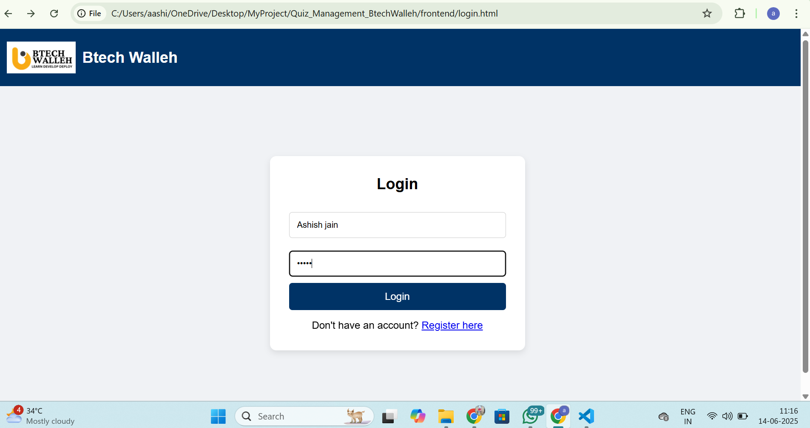
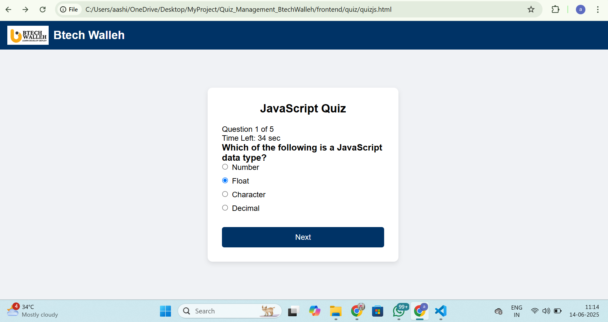

# Btech Walleh Quiz Management Site

This is a basic Quiz Management platform built as part of the Software Development Internship Task at Btech Walleh.

## 🧩 Project Features

- User Registration and Login (Frontend only using localStorage)
- Quiz Category Selection (HTML, CSS, JavaScript)
- Each quiz contains 5 multiple-choice questions
- Timer and Navigation for each quiz
- Score is calculated and shown after submission
- Responsive UI with Btech Walleh branding
- LocalStorage used to store user data and scores

## 📁 Tech Stack Used

- HTML5
- CSS3
- JavaScript (Vanilla)
- LocalStorage for data handling (no backend)

## 🎯 How to Run the Project

1. Clone or Download the project.
2. Open the `registration.html` or `login.html` file in a web browser.
3. Register as a new user and log in.
4. Select a quiz and start answering.
5. Submit the quiz to see your score on the result page.

## 📂 Folder Structure
    Quiz_Management_BtechWalleh/
├── frontend
|   ├── assets/
│       └── logo.png
|    ├── quiz/
│       └── quiz.html
|       └──quiz.css.html
|       └──quizcss.js
|       └── quizhtml.html
|       └──quizhtml.js
|       └──quizjs.html
|       └──quizjs.js
|   ├── login.html
|   ├── login.js
|   ├── registration.html
|   ├── registration.js
|   ├── style.css
|   ├── readme.md

## 📌 Notes

- This is a basic frontend-only project made for learning purposes.
- Project is not hosted currently, open the HTML files directly in the browser.

## 📅 Submission

- Project submitted as per the internship task.
- Theme Selected: **Quiz Management Site**
- Submitted On: 15 June 2025

## 📸 Screenshots

### 🔐 Login Page

### 📝 Register Page

### ❓ Quiz Page

